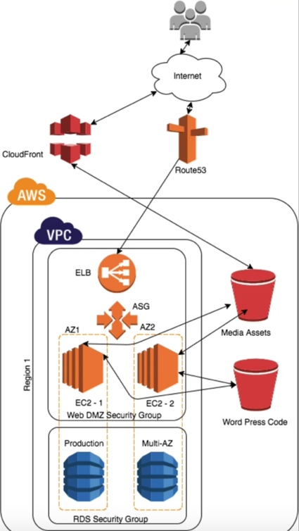

# Achieve Fault tolerant, HA, Resilience and Auto scaling using AWS services in application

## Use case: 
We have a web application and want to achieve High availability, Fault tolerance, Auto scaling and load balancing using AWS cloud provider’s services.

## Below are the steps to create and configure all required AWS services to achieve above functionality:

**Step#1:** Create a S3 bucket to keep latest code

**Step#2:** Create a public S3 bucket to store media files

**Step#3:** Create a cloud front distributions using domain name of media s3 bucket

**Step#4:** Create a security group for EC2 instances to provide access on port 80

**Step#5:** Create a security group for RDS instances to provide access on port 3306 and 80

**Step#6:** Create a MySQL/Aurora instance with multi AZ feature and RDS security group

**Step#7:** Create a role for EC2 instances to provide S3FULLACCESS

**Step#8:** Create an EC2 instance with above role and bootstrap script (steps to install all pre-requisites)

**Step#9:** Configure word press application with MYSQL through EC2

**Step#10:** Create a post on word press site with some media files i.e. images

**Step#11:** Copy word press code to S3 bucket to use it later in Auto scaling

**Step#12:** Update .htaccess to rewrite URL of media images in word press with cloud front URL and httpd.conf to allow rewrite URL

**Step#13:** Restart httpd service to reflect the above changes

**Step#14:** Create crontab to sync S3 bucket code from EC2 instance and s3 media bucket from word press media. Restart crontab service

**Step#15:** Create EC2 image to use it later

**Step#16:** Create EC2 instance using above created image and bootstrap script of syncing word press code from S3 bucket

**Step#17:** Create Auto scaling group using multiple subnets and with group size of two instance

**Step#18:** Create an application load balancer by adding EC2 instance in target group created from auto scaling group

## Consume Amazon web services:
These AWS Services are being used in this web application.
-	EC2 Instance
-	CloudFront Distribution
-	S3 bucket
-	Load Balancer
- Auto Scaling Group
- MySQL
-	AWS IAM
-	AWS Security Groups

## Architecture:

 
## Achieved desired benefits:
-	High Availability
-	Fault Tolerance
-	Resilience
-	Auto Scaling
-	Manage traffics

