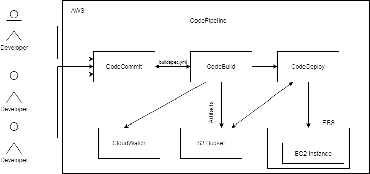

# End to end automation of web application using AWS services

## Use case:
Migrate our web application from GitHub to AWS where multiple developers work on the same code. As soon as a developer commits the code a new build should be created, tested and deployed automatically.

## Below are the steps to create a AWS Code pipeline using all the native AWS tools:

**Step#1:** Create a Code Commit Repository and add web application code from GitLab/GitHub

**Step#2:** Create Code Build

**Step#3:** Create Beanstalk Application

**Step#4:** Create Code Deploy

**Step#5:** Create Code Pipeline

## Consume Amazon web services:

These AWS Services are being used in this end to end automation approach.

 - AWS CodeCommit 
 - AWS CodeBuild
 - AWS CodeDeploy
 - AWS CodePipeline
 - Elastic Beanstalk
 - S3 Bucket
 - EC2 Instance
 - Elastic IP
 - CloudWatch

## Continuous Integration and Continuous Delivery in AWS:
 

## Benefits

 - Automation of Build, Test and Release Process
 - Pipeline History
 - Reports and Pipeline Status Visualizations
 - 	Establish a consistent release process
 - Speed up delivery while improving quality
 - Supports external tools integration for source, build and deploy
 - Auto Scaling and monitoring logs with CloudWatch
